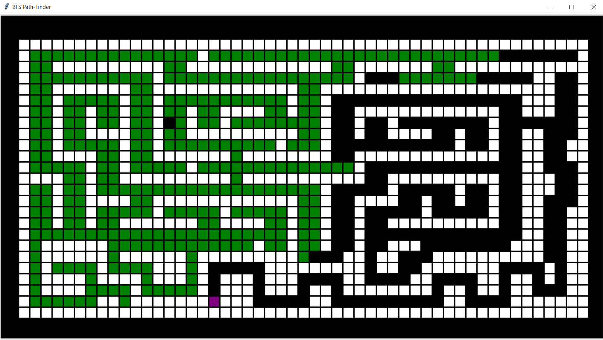

# Path-Finder
Different approaches to implementing a Path-Finding Algorithm, from Noob Level to Pro-Noob Level

## String Approach :
The script takes two String inputs(Jumbled and Correct) and uses Priority Queue to get the final desired combination of words by using the *A** *Algorithm*

Try Running `String A* Algorithm.py` to test with Strings

## Turtle GUI Approach :
 The script creates a GUI in turtle for visualizing the Breadth First Search in a Maze using the *Path-Finder Algorithm*
 
 A *Backtracking Algorithm* to find possible routes to the destination and finds the shortest route using Queue
 
 Try Running `PathFinder with BFS.py` to see it in action!

#### Turtle GUI Visualization :

*The program starts by drawing the maze for visualization:*

*The traversal is starts and the visited points are marked green -*

*After the traversal ends, the shortest route is plotted and marked in yellow.*

